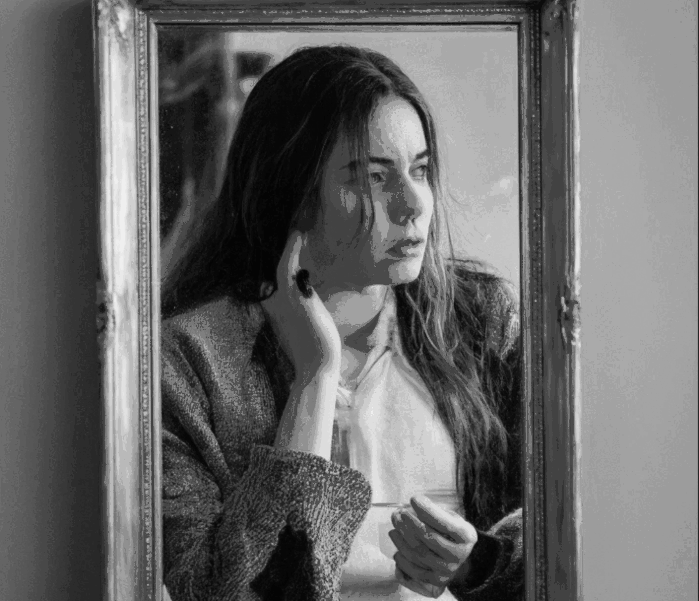

# stable-clipstagram

An end-to-end AI pipeline demonstrating the practical integration of generative and discriminative models for automated content creation. The system analyzes existing Instagram content using CLIP to learn patterns, generates contextual captions using Llama 3.2, and creates new images using Stable Diffusion 3. This project showcases how modern AI models can be chained together to create a fully automated content generation pipeline, with built-in optimizations like OpenCV-based image fingerprinting to cache rankings and avoid redundant computations.

## Generated Examples
Prompts used to generate below images are generated by AI based on some source accounts:

- "In the mirror, we often see only what's on the surface, but the truth lies within. A glance inside can change everything."
- "Symbol of hope in darkness"
- "A glimpse into the beauty that unfolds when life becomes just another canvas waiting to be explored"
- "Thought-provoking images that capture love and sometimes, controversy."
- "A glowing aura surrounds purpose, even when systems crash and the mind freezes."


## Technical Stack

- **Computer Vision**: OpenAI CLIP for zero-shot image ranking and OpenCV for image fingerprinting and caching
- **Text Generation**: Llama 3.2 (1B) for context-aware captions
- **Image Generation**: Stable Diffusion 3
- **Integration**: Instagram API via instagrapi and instaloder
- **Optimization**: Pickle-based caching of image embeddings


## Features

- 🤖 CLIP-based image quality assessment and ranking
- 🔤 Local LLM integration for caption generation
- 🎨 Batch image generation with Stable Diffusion 3
- 📊 Automated content quality control
- 💨 Performance optimization with OpenCV fingerprinting
- 📱 Instagram API integration


## Setup

1. Clone and install dependencies:
```bash
git clone https://github.com/Zhreyu/stable-clipstagram.git
cd stable-clipstagram
pip install -r requirements.txt
```

2. Install Ollama and Llama 2:
```bash
curl -fsSL https://ollama.com/install.sh | sh
ollama pull llama3.2:1b
ollama serve
```

3. Configure environment:
```bash
# Create .env file
INSTAGRAM_USERNAME=your_username
INSTAGRAM_PASSWORD=your_password
SOURCE_ACCOUNTS=account1,account2,account3
```

## Usage

```bash
python main.py
```

## Learning Points

- **CLIP Applications**: Practical usage of CLIP for image ranking beyond basic image-text matching
- **Local LLM Integration**: Using Ollama for efficient local caption generation
- **AI Pipeline Design**: Combining multiple AI models in a production-ready pipeline
- **Quality Control**: Implementing automated content curation using AI

## Contributing

Feel free to:
- Suggest model optimizations
- Add alternative model implementations
- Improve the pipeline efficiency
- Enhance documentation

## License

MIT License - See LICENSE file

## Author

[@Zhreyu](https://github.com/Zhreyu)

## Disclaimer

This project is for educational purposes. Ensure compliance with Instagram's terms of service when using this tool.

